# Marty Global LLC — Customer Guide

**The complete journey, from first visit to a live company with mail arriving.**

This guide follows one customer end to end. Every screen you will meet is shown,
every button is explained, and every action says what happens next.

---

## How to read this guide

The guide is written in the order you will actually do things:

| Part | What it covers |
| --- | --- |
| 1 | Looking around the public site |
| 2 | Creating your account |
| 3 | Finding your way around the portal |
| 4 | Ordering a service |
| 5 | Tracking an order |
| 6 | Quotes and paying |
| 7 | Your virtual mail room |
| 8 | Your document library |
| 9 | Your delivered companies and records |
| 10 | Talking to us |
| 11 | Notifications |
| 12 | Account settings |

**About the screenshots.** Every screen is captured twice — once on a desktop
browser (1440 × 900) and once on a phone (390 × 844) — so you can follow along on
whichever you are using. Both files are named in each step. They all live in
`Documentation/screenshots/`.

**A note on what you see.** These captures come from a working demo account
(*Daniel Reyes*, with a Delaware company called *Harbor Line Trading LLC*). Your
own names, references, and amounts will differ. Three details are demo-specific
and are flagged where they appear: the payment screen names a test network, the
payment history is empty because no transfer was actually sent, and card payment
is switched off.

---

# Part 1 · Looking around the public site

You do not need an account to read anything in this part.

## 1.1 The home page

Open **martyglobal.com**. The top navigation is the same on every public page:
**Home · Services · How It Works · FAQ · About Us · Contact**, with a **Get
Started** button on the right.

The headline offer is *Launch Your Business Anywhere in the World* — forming a
company, opening a business bank account, and handling your mail across the US,
UK, Canada, and Europe. Two buttons sit under it:

- **Start Your LLC** — takes you straight into creating an account.
- **See How It Works** — walks through the process first, no commitment.

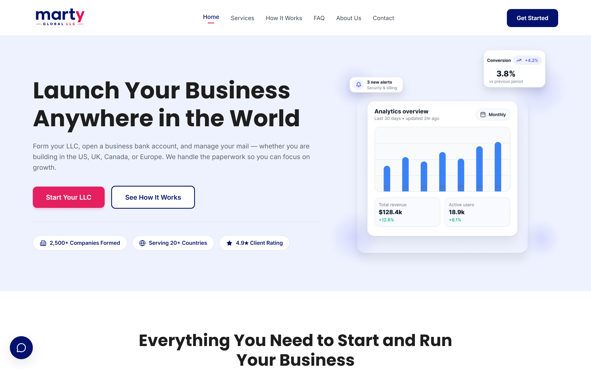

> Desktop: `Documentation/screenshots/01-01-home-hero-desktop.png`
> Mobile: `Documentation/screenshots/01-01-home-hero-mobile.png`

## 1.2 What we can do for you

Scroll down the home page and you reach *Everything You Need to Start and Run
Your Business* — the four services, each with what is included and which regions
it covers.

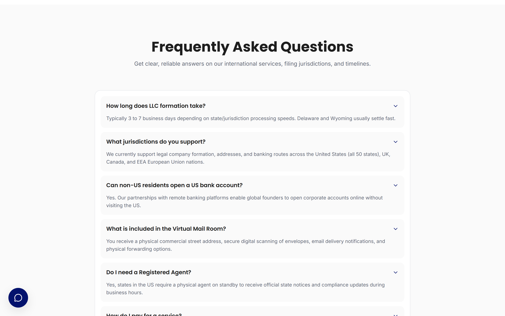

> Desktop: `Documentation/screenshots/01-02-home-services-desktop.png`
> Mobile: `Documentation/screenshots/01-02-home-services-mobile.png`

## 1.3 The Services page

**Services** in the top navigation gives each service its own full description —
what we file, what you need to supply, and how long it usually takes.

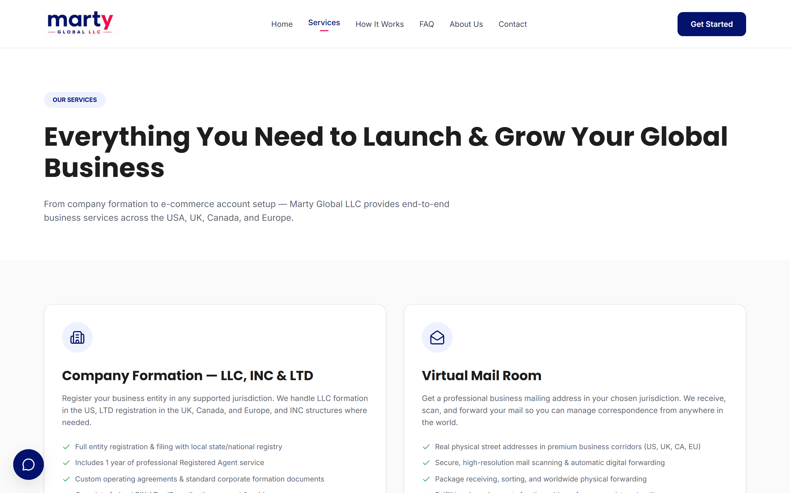

> Desktop: `Documentation/screenshots/01-03-services-page-desktop.png`
> Mobile: `Documentation/screenshots/01-03-services-page-mobile.png`

## 1.4 How it works

**How It Works** lays out the sequence you are about to follow: you submit an
application, we review it, we send you a priced quote, you pay, we file, and the
result lands in your portal.

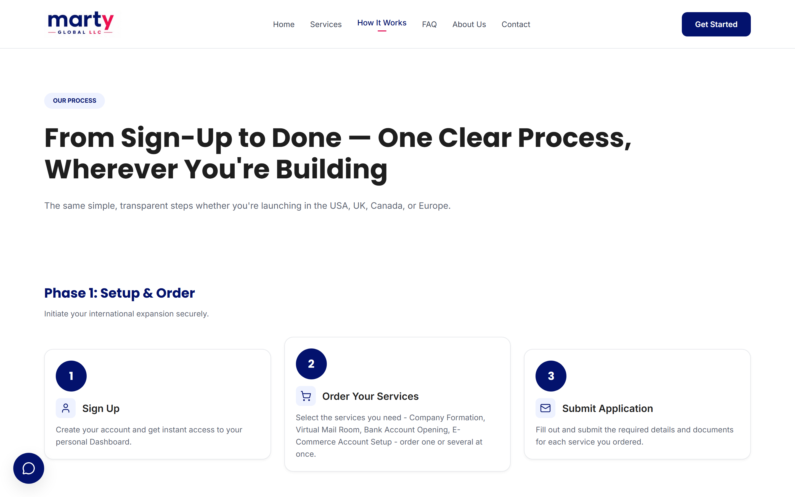

> Desktop: `Documentation/screenshots/01-04-how-it-works-desktop.png`
> Mobile: `Documentation/screenshots/01-04-how-it-works-mobile.png`

## 1.5 Questions and prices

**FAQ** is the full question library, grouped by topic.

On price: you will not find a price list on the public site, and that is
deliberate. What a filing costs depends on the service, the jurisdiction, and
that jurisdiction's own government fees. The binding figure is the itemised
quote we issue in your portal after we have read your application — see
[Part 6](#part-6--quotes-and-paying).

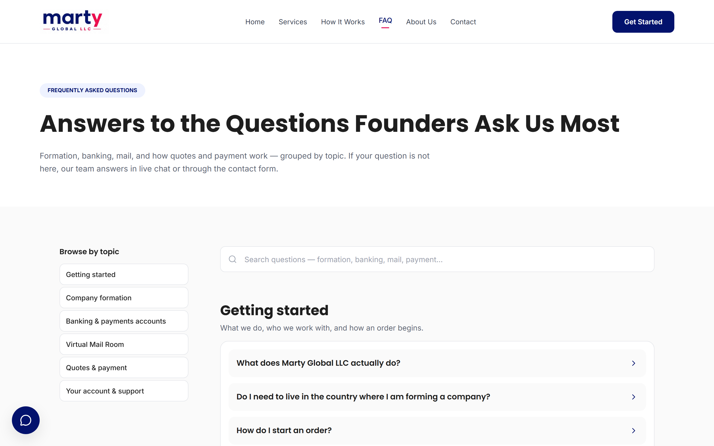

> Desktop: `Documentation/screenshots/01-05-faq-desktop.png`
> Mobile: `Documentation/screenshots/01-05-faq-mobile.png`

## 1.6 Getting in touch before you sign up

**Contact** has a form that reaches our team directly. Fill in your details and
your question and send it — no account needed. The form is protected against
automated abuse, so you may be asked to complete a quick challenge.

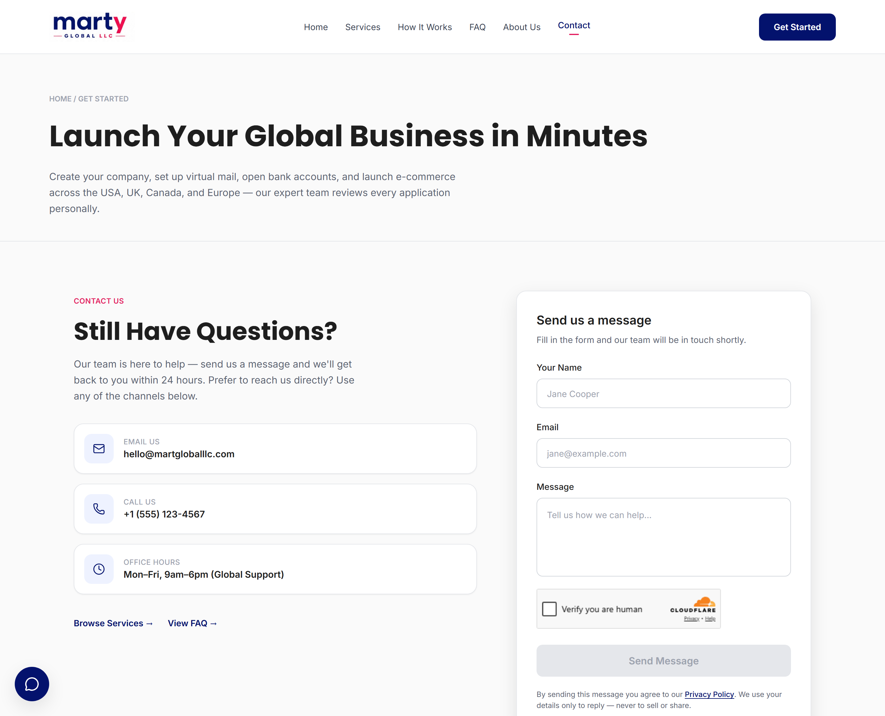

> Desktop: `Documentation/screenshots/01-06-contact-desktop.png`
> Mobile: `Documentation/screenshots/01-06-contact-mobile.png`

## 1.7 Asking a question by chat

The round chat button in the bottom-right corner of every public page opens a
live conversation with our team. If nobody is available, leave your message and
your email — we reply by email rather than leaving you waiting.

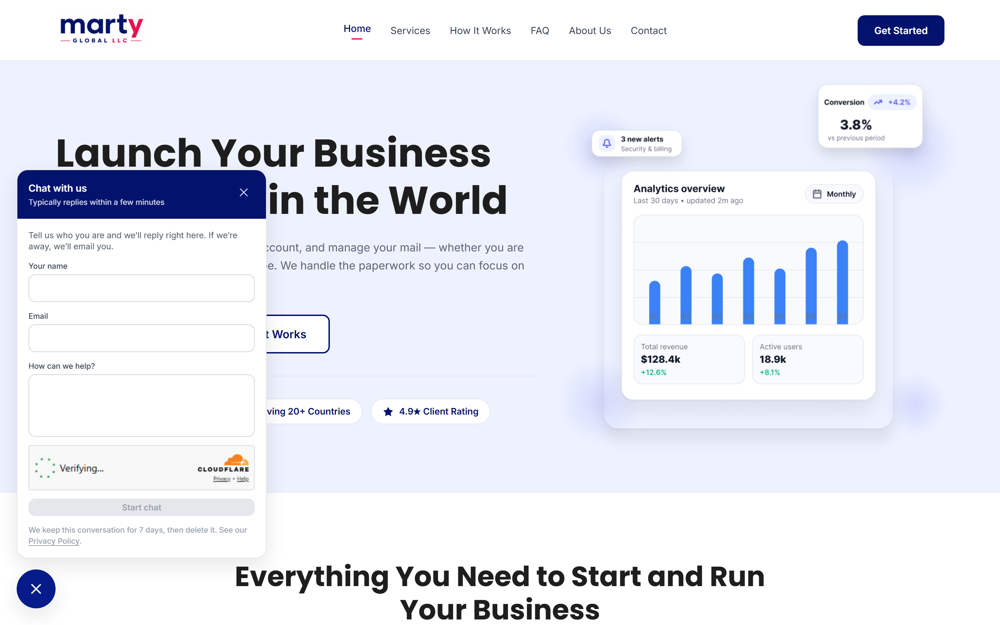

> Desktop: `Documentation/screenshots/01-07-public-chat-desktop.png`
> Mobile: `Documentation/screenshots/01-07-public-chat-mobile.png`

---

# Part 2 · Creating your account

## 2.1 Signing up

**Get Started** (or **Start Your LLC**) brings you to the sign-up screen. If you
have created an account on this device before, the same button sends you to the
log-in screen instead.

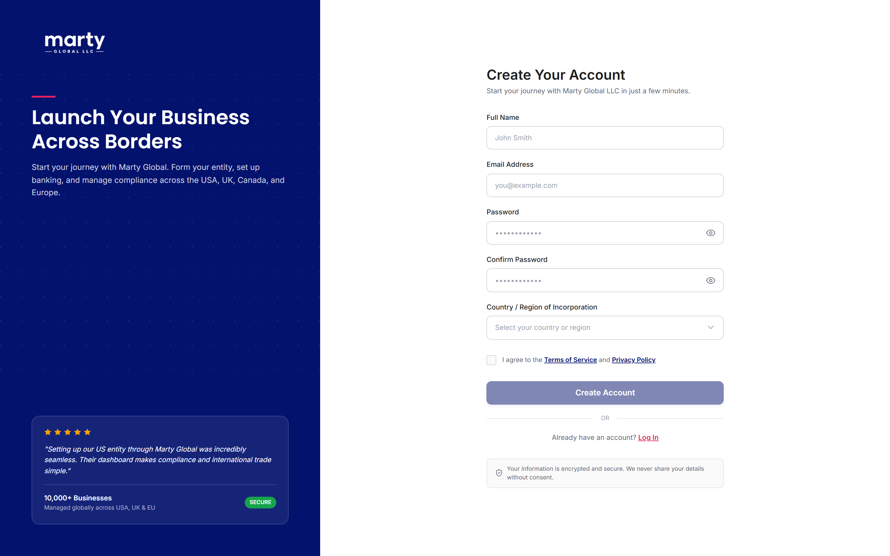

> Desktop: `Documentation/screenshots/02-01-signup-blank-desktop.png`
> Mobile: `Documentation/screenshots/02-01-signup-blank-mobile.png`

Fill in six things:

| Field | Notes |
| --- | --- |
| **Full Name** | Your own name, not the company's. |
| **Email Address** | Where every notification and quote will go. Use one you check. |
| **Password** | Use the eye icon at the right of the field to check what you typed. |
| **Confirm Password** | Must match exactly. |
| **Country / Region of Incorporation** | United States, United Kingdom, Canada, or Europe. A starting point, not a commitment — you choose the exact jurisdiction later. |
| **Terms checkbox** | Tick to agree to the Terms of Service and Privacy Policy. Both links open in a new tab so you do not lose the form. |

**Create Account** stays greyed out until the terms box is ticked.

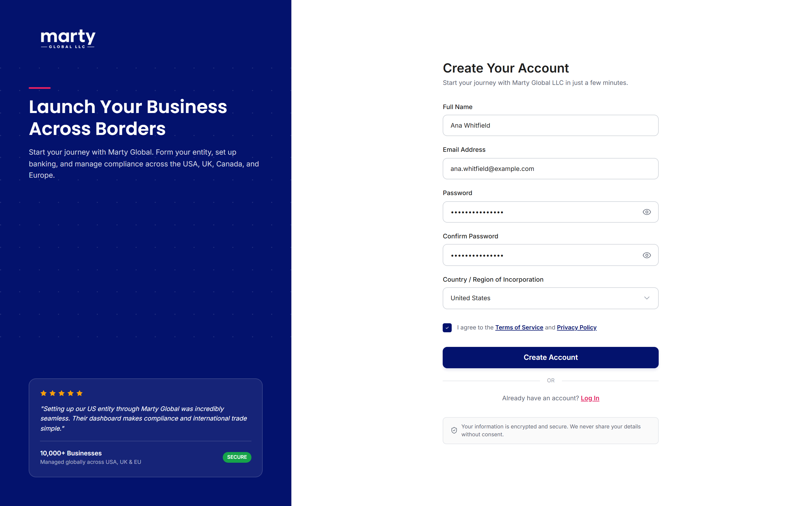

> Desktop: `Documentation/screenshots/02-02-signup-filled-desktop.png`
> Mobile: `Documentation/screenshots/02-02-signup-filled-mobile.png`

## 2.2 Logging in

After your account is created you are taken to the log-in screen. Enter the email
and password you just chose.

**Remember Me** keeps you signed in on this device, so you land straight in your
dashboard next time. Leave it off on a shared or public computer.

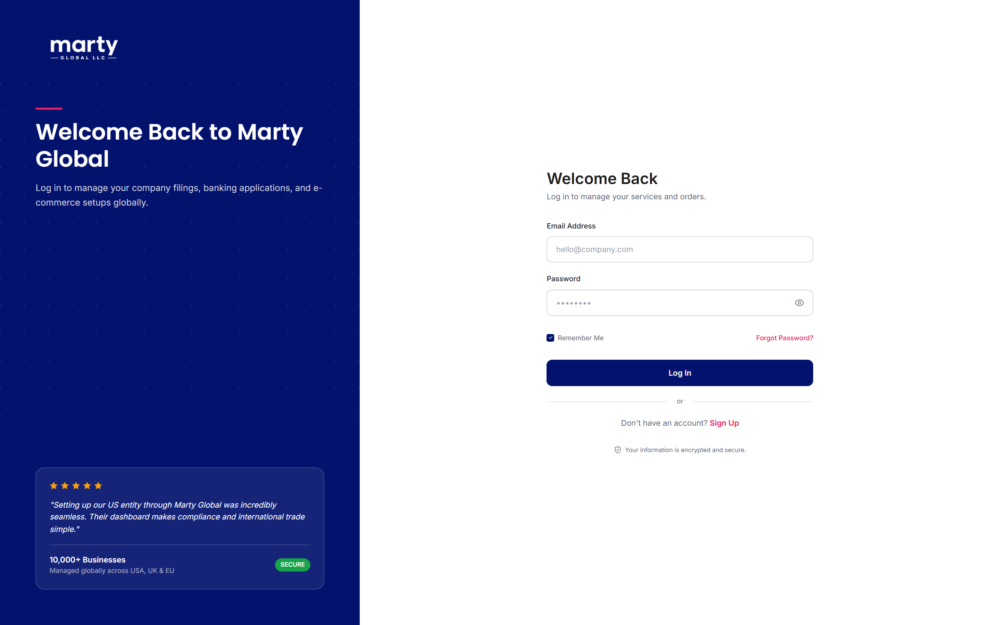

> Desktop: `Documentation/screenshots/02-03-login-desktop.png`
> Mobile: `Documentation/screenshots/02-03-login-mobile.png`

A successful log-in takes you to your dashboard.

## 2.3 Forgotten password

**Forgot password?** on the log-in screen opens *Reset Your Password*. Enter your
email address and press **Send Reset Link**.

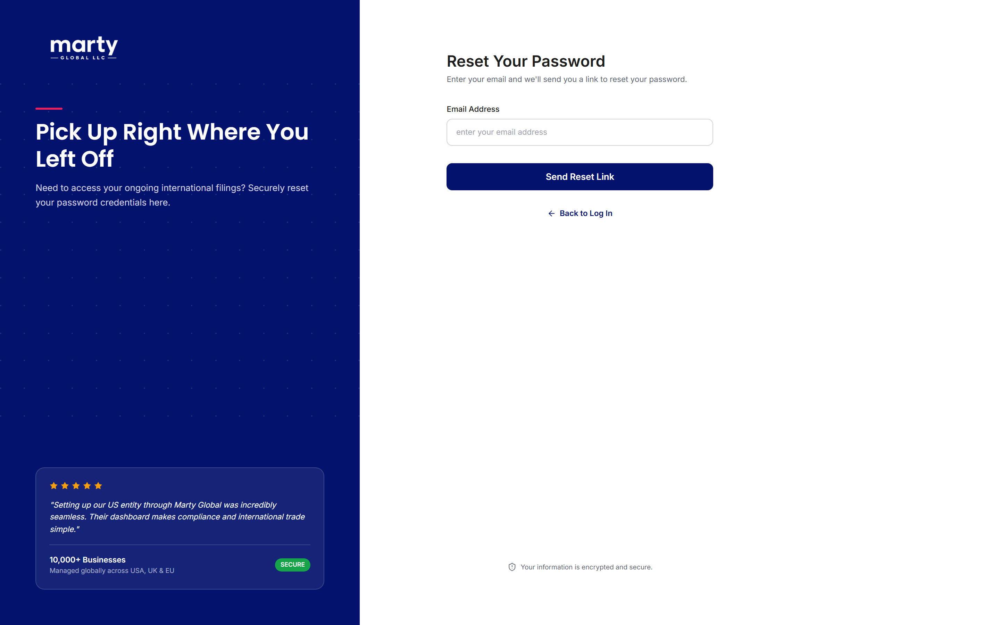

> Desktop: `Documentation/screenshots/02-04-forgot-password-desktop.png`
> Mobile: `Documentation/screenshots/02-04-forgot-password-mobile.png`

We then confirm the email is on its way. Open the link in that email to choose a
new password. The link is single-use and expires, so request a fresh one if it
has been sitting in your inbox a while.

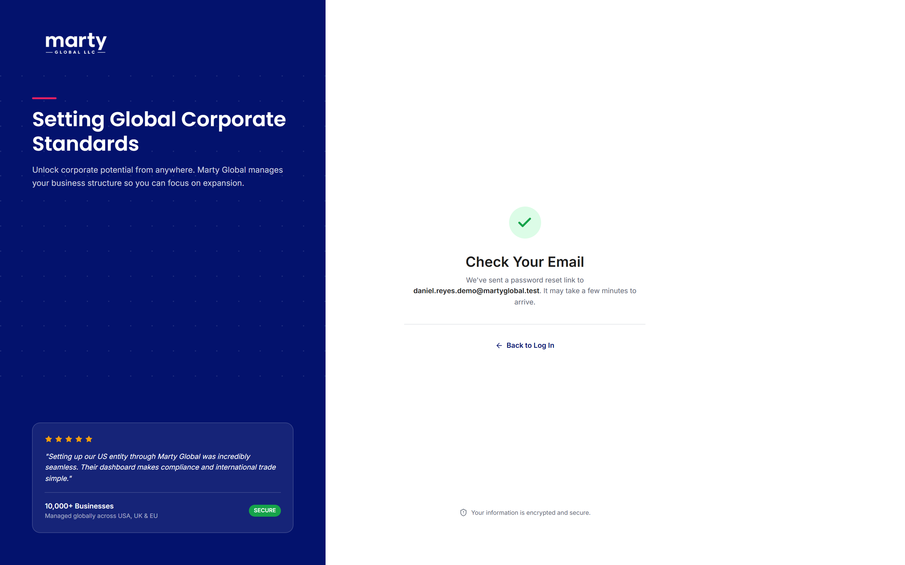

> Desktop: `Documentation/screenshots/02-05-check-your-email-desktop.png`
> Mobile: `Documentation/screenshots/02-05-check-your-email-mobile.png`

---

# Part 3 · Finding your way around

## 3.1 Your dashboard

The dashboard is your home screen. It answers one question: *does anything need
me right now?*

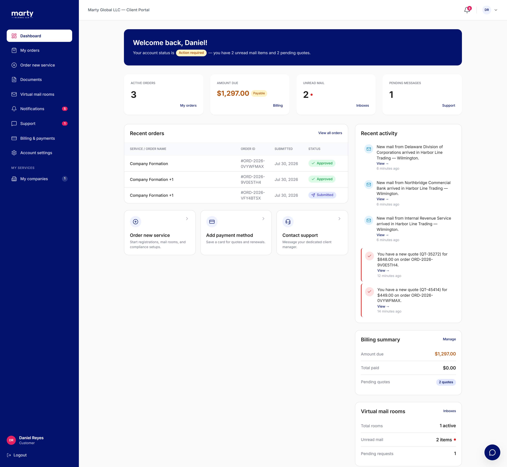

> Desktop: `Documentation/screenshots/03-01-dashboard-desktop.png`
> Mobile: `Documentation/screenshots/03-01-dashboard-mobile.png`

**The welcome banner** carries your account status. **Active & compliant** means
nothing is waiting on you. **Action required** is followed by the reason — in the
screenshot, unread mail and pending quotes.

**The four figures** across the top each link to the screen behind them:

| Card | Meaning |
| --- | --- |
| **Active orders** | Applications not yet completed. Links to *My orders*. |
| **Amount due** | Total of every unpaid quote. A **Payable** tag means you can pay now. Links to *Billing*. |
| **Unread mail** | Scanned items you have not opened. A red dot marks new arrivals. Links to *Inboxes*. |
| **Pending messages** | Replies from us you have not read. Links to *Support*. |

**Recent orders** lists your latest applications with reference, submission date,
and status. **View all orders** opens the full list.

**Recent activity** is the running log of everything that has happened — mail
arriving, quotes issued, orders progressing. Items that need you are marked with
a red edge. Each has a **View →** link to the thing itself.

**The three action cards** are shortcuts: *Order new service*, *Add payment
method*, and *Contact support*.

**Billing summary** and **Virtual mail rooms** repeat the key numbers with links
to manage each.

### The sidebar

The left sidebar is your main navigation, and it is the same everywhere:

**Dashboard · My orders · Order new service · Documents · Virtual mail rooms ·
Notifications · Support · Billing & payments · Account settings**

Under **MY SERVICES** the sidebar grows as we deliver things to you. Once your
first company is filed, **My companies** appears with a count beside it. Red
badges on *Notifications* and *Support* count unread items.

Your name and **Logout** sit at the bottom.

## 3.2 The notification bell

The bell in the top bar shows your unread count. Click it for the five most
recent notifications, each linking to what it is about.

**Mark all as read** clears the badge. The gear icon jumps to your notification
settings. **View all notifications** opens the full feed ([Part 11](#part-11--notifications)).

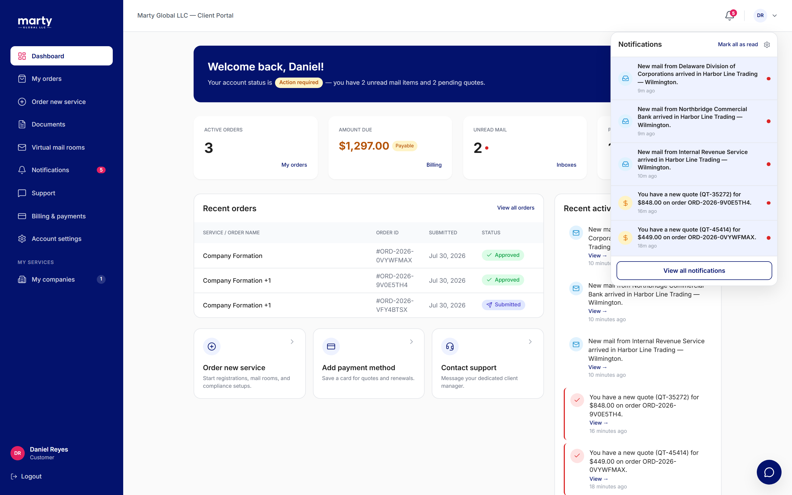

> Desktop: `Documentation/screenshots/03-02-notifications-panel-desktop.png`
> Mobile: `Documentation/screenshots/03-02-notifications-panel-mobile.png`

## 3.3 Your account menu

Your initials at the top right open the account menu — a shortcut to your
settings and to logging out.

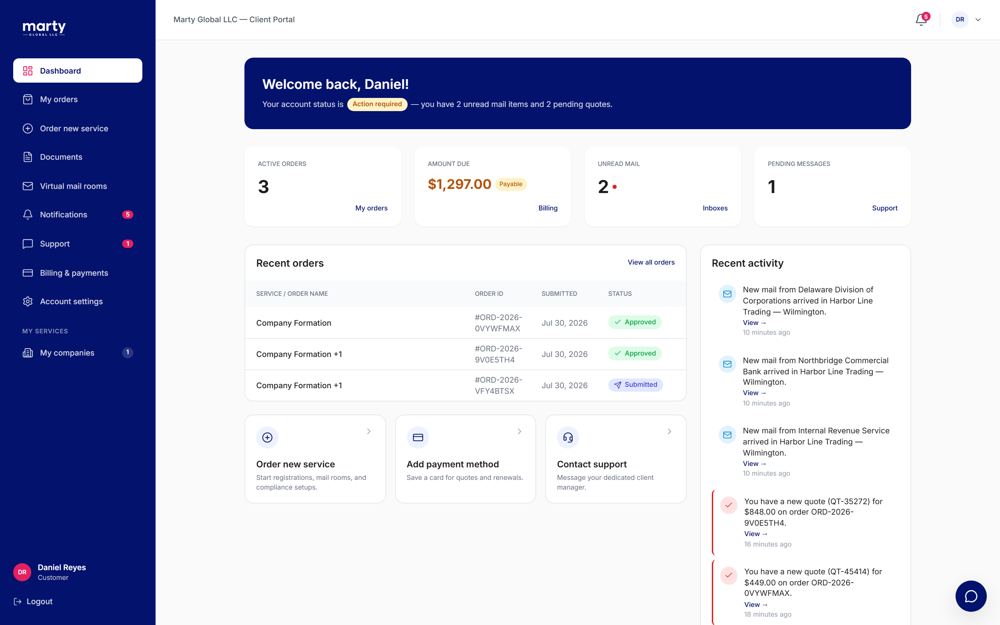

> Desktop: `Documentation/screenshots/03-03-account-menu-desktop.png`
> Mobile: `Documentation/screenshots/03-03-account-menu-mobile.png`

## 3.4 On a phone

On a phone the sidebar is hidden behind the **☰** button at the top left. Tap it
and the full menu slides in; tap any item, or outside the menu, to close it. The
bell and your initials stay in the header.

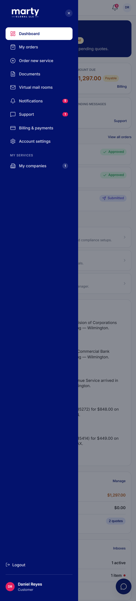

> Mobile only: `Documentation/screenshots/03-04-mobile-navigation-mobile.png`

---

# Part 4 · Ordering a service

Ordering is three steps: **pick your services → answer the questions → review and
submit**. You can order several services in one application, and you answer each
question only once even when two services need the same answer.

## Step 1 · Select services

**Order new service** in the sidebar opens the catalog. Each card shows what the
service includes and which regions it covers.

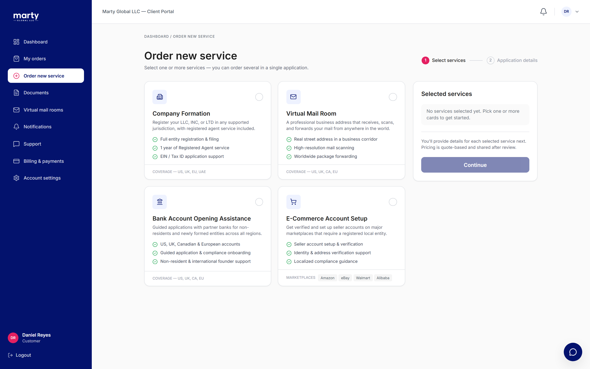

> Desktop: `Documentation/screenshots/04-01-order-step1-select-services-desktop.png`
> Mobile: `Documentation/screenshots/04-01-order-step1-select-services-mobile.png`

Click a card — anywhere on it — to select it. The circle at its top right fills
in, and the service is added to **Selected services** on the right. Click again
to remove it.

The panel reminds you that pricing is quote-based and shared after review, then
**Continue** becomes available.

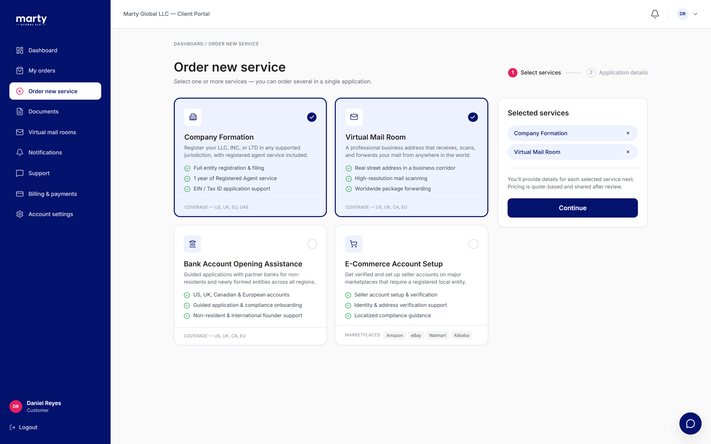

> Desktop: `Documentation/screenshots/04-02-order-step1-selected-desktop.png`
> Mobile: `Documentation/screenshots/04-02-order-step1-selected-mobile.png`

On a phone the selection summary and **Continue** sit in a bar pinned to the
bottom of the screen instead of a side panel.

## Step 2 · Application details

Now we ask what we need in order to file. The questions are built from the
services you picked, so this form is different for everyone. **Selected
services** stays at the top with a **Change selection** link back to Step 1.

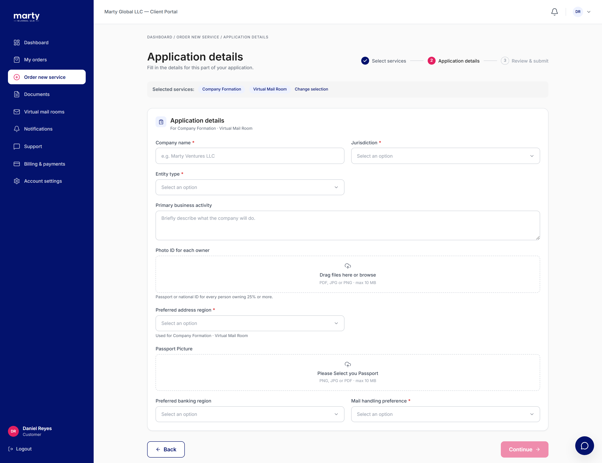

> Desktop: `Documentation/screenshots/04-03-order-step2-details-blank-desktop.png`
> Mobile: `Documentation/screenshots/04-03-order-step2-details-blank-mobile.png`

For a company formation with a mail room, that is:

| Field | What to enter |
| --- | --- |
| **Company name** \* | The name you want registered. |
| **Jurisdiction** \* | Where to register — e.g. *United States — Delaware*, *United Kingdom*. |
| **Entity type** \* | LLC, INC, or LTD. |
| **Primary business activity** | A sentence on what the business does. Helps us anticipate licence questions. |
| **Photo ID for each owner** | Passport or national ID for everyone owning 25% or more. |
| **Preferred address region** \* | Which region your registered address should be in. |
| **Passport Picture** | The photo page of your passport. |
| **Preferred banking region** | Where you would like to bank, if you asked for banking help. |
| **Mail handling preference** \* | Scan, forward, or both. |

Fields marked \* are required. A note under a field tells you which of your
selected services will use that answer.

**Uploading files.** Drop a file on the dashed area or click **browse**. PDF,
JPG, and PNG are accepted, up to 10 MB each. The file uploads immediately and
appears as a row with its name and size, and an **✕** to remove it. If an upload
fails you will see a message saying so — try it again; nothing else is lost.

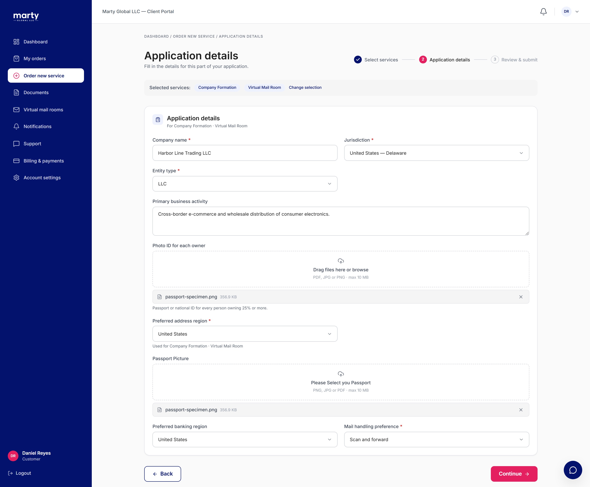

> Desktop: `Documentation/screenshots/04-04-order-step2-details-filled-desktop.png`
> Mobile: `Documentation/screenshots/04-04-order-step2-details-filled-mobile.png`

**Continue** moves on. **Back** returns to Step 1 and keeps your answers.

## Step 3 · Review & submit

The last step is for anything extra.

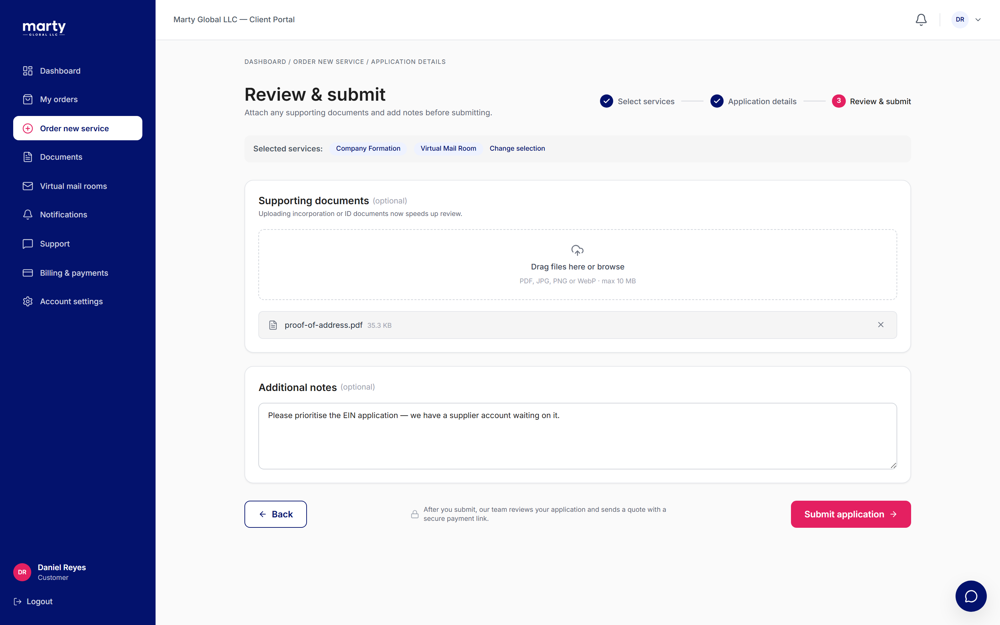

> Desktop: `Documentation/screenshots/04-05-order-step3-review-submit-desktop.png`
> Mobile: `Documentation/screenshots/04-05-order-step3-review-submit-mobile.png`

- **Supporting documents** (optional) — anything else that helps: an existing
  incorporation certificate, proof of address, a licence. Uploading now speeds up
  review.
- **Additional notes** (optional) — specific requirements, deadlines, or
  questions. Our reviewer reads this.

**Submit application** sends it. The button reports its own progress, so you
cannot submit twice by accident.

## Step 4 · Confirmation

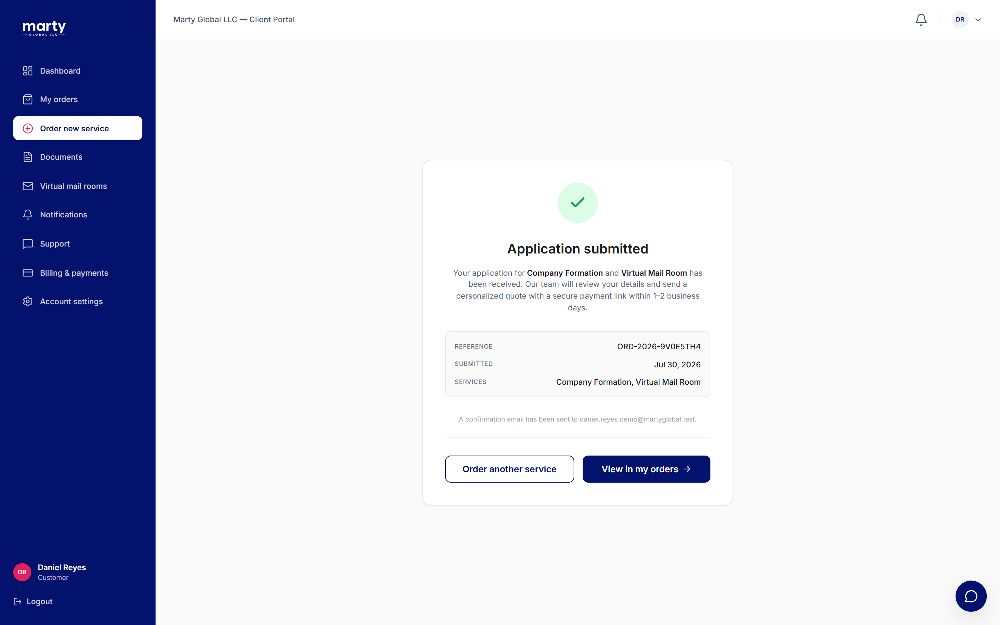

> Desktop: `Documentation/screenshots/04-06-order-submitted-desktop.png`
> Mobile: `Documentation/screenshots/04-06-order-submitted-mobile.png`

You get your **order reference** — for example `ORD-2026-VFY4BTSX` — the
submission date, and the services included. **Keep the reference**: it is how you
and we refer to this application.

A confirmation email goes to your address, and we tell you what happens next:
our team reviews your details and sends a personalised quote with a secure
payment link, usually within 1–2 business days.

Two buttons finish the flow: **Order another service** starts a new application,
**View in my orders** opens the one you just submitted.

---

# Part 5 · Tracking an order

## 5.1 The orders list

**My orders** lists every application you have ever submitted.

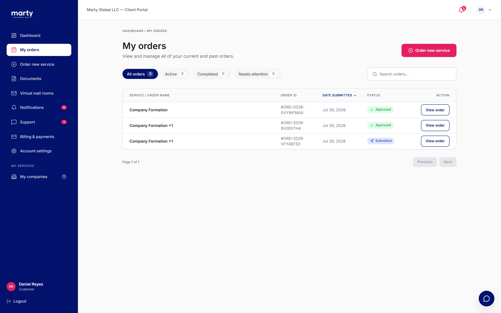

> Desktop: `Documentation/screenshots/05-01-orders-list-desktop.png`
> Mobile: `Documentation/screenshots/05-01-orders-list-mobile.png`

The tabs across the top filter by state and carry counts: **All orders ·
Active · Completed · Needs attention**. *Needs attention* is the one to watch —
it collects orders waiting on you. **Search orders…** matches a reference or a
service name.

Statuses you will see:

| Status | Meaning |
| --- | --- |
| **Submitted** | With us, not yet reviewed. |
| **Approved** | Reviewed and priced. A quote is waiting for you. |
| **Processing** | Paid, and being filed. |
| **Completed** | Done. The result is on your record. |

On desktop this is a table; on a phone each order is a card with a **View
order** button. Either way, opening an order takes you to its detail screen.

## 5.2 One order in detail

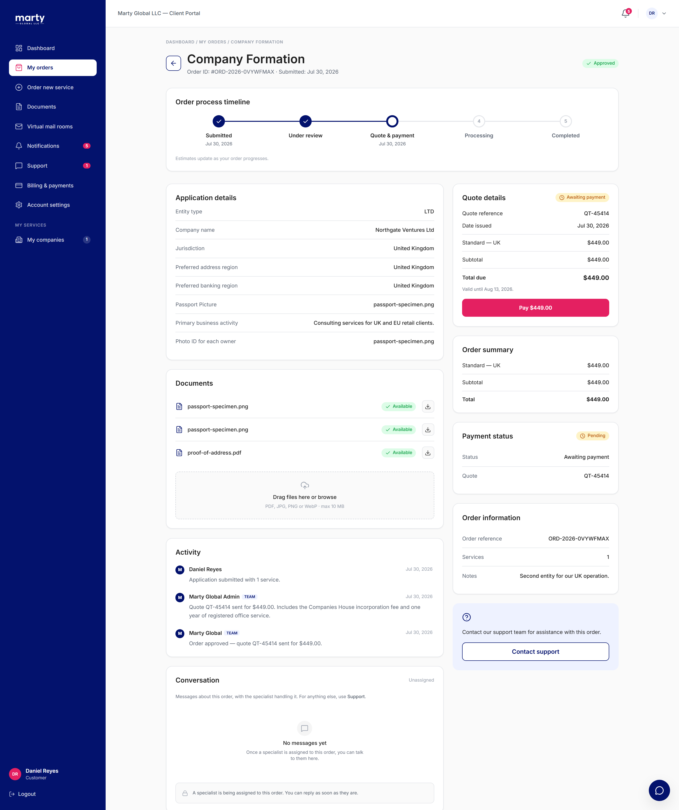

> Desktop: `Documentation/screenshots/05-02-order-detail-desktop.png`
> Mobile: `Documentation/screenshots/05-02-order-detail-mobile.png`

**Order process timeline** across the top shows the five stages — **Submitted →
Under review → Quote & payment → Processing → Completed** — with dates on the
ones already passed and a hollow ring on where you are now.

Down the left:

- **Application details** — exactly what you submitted. Worth checking a name
  before we file it.
- **Documents** — every file on this order, each marked **Available** with a
  download button. The drop area lets you add more at any time, which is how you
  answer a request for a missing document.
- **Activity** — the audit trail: your submission, quotes we sent, status
  changes. Each entry is stamped with who did it and when.
- **Conversation** — messages about *this order* with the specialist handling it.
  Until one is assigned you will see *A specialist is being assigned to this
  order*. For anything not about this order, use **Support** instead.

Down the right:

- **Quote details** — the quote reference, issue date, each line item, and
  **Total due**, with the date it is **valid until** and a **Pay** button. The
  tag reads **Awaiting payment** until it settles.
- **Order summary** — the same line items as a plain total.
- **Payment status** — **Pending** / **Awaiting payment** / paid, with the quote
  it refers to.
- **Order information** — reference, number of services, and any notes you left.
- **Contact support** — opens a conversation about this order.

## 5.3 Messages on an order

Once a specialist is assigned, their replies appear in **Conversation** and you
can reply in the same box. In the screenshot below, our team has confirmed the
Delaware certificate was filed, the EIN letter arrived, and the mail room is
live.

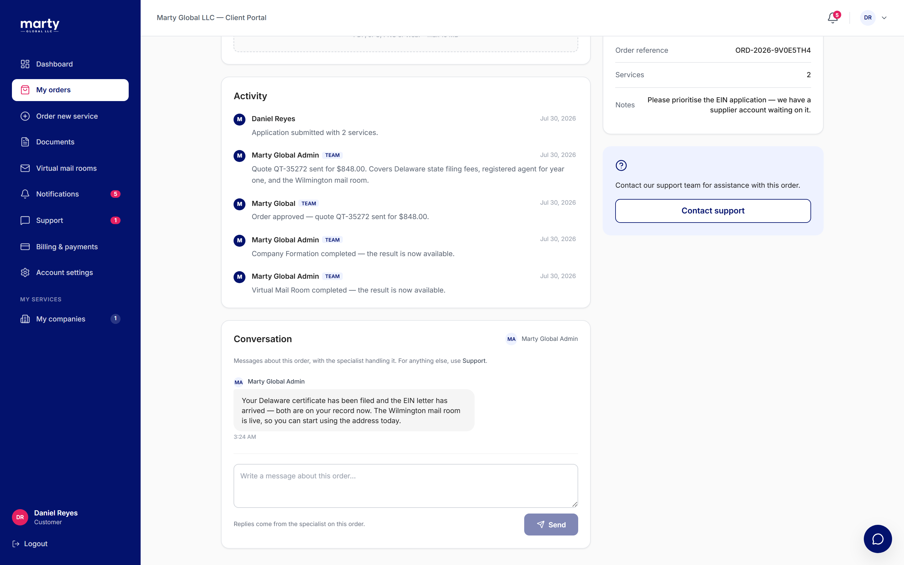

> Desktop: `Documentation/screenshots/05-03-order-detail-activity-desktop.png`
> Mobile: `Documentation/screenshots/05-03-order-detail-activity-mobile.png`

---

# Part 6 · Quotes and paying

Nothing is charged up front. We read your application, price it, and send you an
itemised quote. You pay only once you have seen the figure.

## 6.1 Billing & payments

**Billing & payments** in the sidebar is the whole money picture.

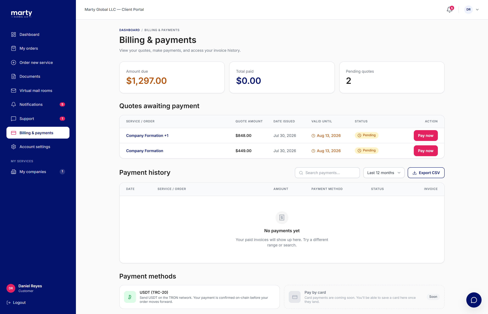

> Desktop: `Documentation/screenshots/06-01-billing-overview-desktop.png`
> Mobile: `Documentation/screenshots/06-01-billing-overview-mobile.png`

**The three figures** are **Amount due**, **Total paid**, and **Pending
quotes**.

**Quotes awaiting payment** is the list that matters. For each quote: the
service and order it belongs to, the **quote amount**, the **date issued**, the
date it is **valid until** (in amber, with a clock — quotes expire), its status,
and a **Pay now** button.

> If a quote expires before you pay, you do not lose anything — ask us and we
> reissue it. Prices can move because government fees move.

**Payment history** is every settled payment, with a search box, a date-range
selector (default *Last 12 months*), and **Export CSV** for your bookkeeping.
Each row links to its invoice.

> In these screenshots the payment history is empty. Settling a payment needs a
> real transfer on the blockchain, which this demo did not make. On a live
> account, each completed payment appears here with its date, amount, method,
> status, and a downloadable invoice.

**Payment methods** shows what you can pay with:

- **USDT (TRC-20)** — active. USDT sent on the TRON network, confirmed on-chain
  before your order moves forward.
- **Pay by card** — marked **Soon**. Card payments are coming; there is nothing
  to set up yet.

## 6.2 Choosing how to pay

**Pay now** on a quote — or the **Pay** button on the order — opens *Complete
your payment*.

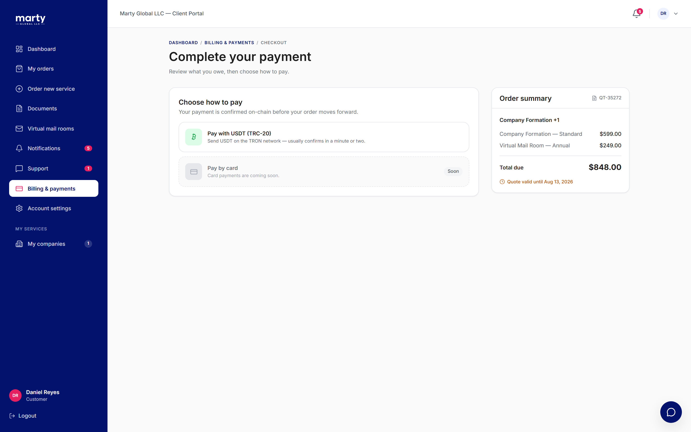

> Desktop: `Documentation/screenshots/06-02-checkout-usdt-desktop.png`
> Mobile: `Documentation/screenshots/06-02-checkout-usdt-mobile.png`

**Order summary** on the right restates what you are paying for: the quote
reference, each service and its price, **Total due**, and the date the quote is
valid until. Check this against your order before you send anything.

On the left, **Choose how to pay**. **Pay with USDT (TRC-20)** is the live
option; **Pay by card** is greyed out and labelled **Soon**.

## 6.3 Paying with USDT

Choosing USDT generates payment instructions for this quote only.

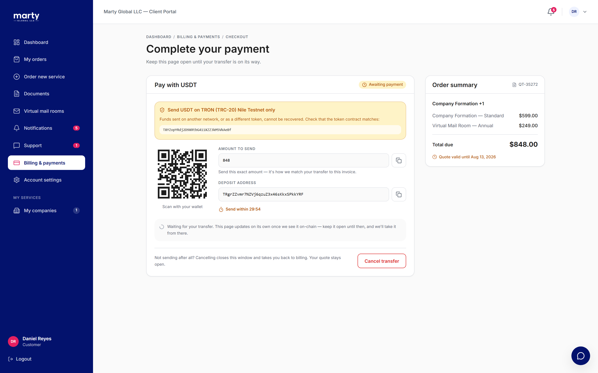

> Desktop: `Documentation/screenshots/06-03-checkout-awaiting-desktop.png`
> Mobile: `Documentation/screenshots/06-03-checkout-awaiting-mobile.png`

Work through it in this order:

1. **Read the amber warning first.** It names the network to send on and shows
   the **USDT token contract address**. Check the contract in your wallet
   matches. Funds sent on another network, or as a different token, cannot be
   recovered.
2. **Send the exact amount** shown under *Amount to send*. Use the copy button.
   The amount is how we match your transfer to this invoice, so a rounded or
   altered figure delays it.
3. **Send to the deposit address** shown, or scan the QR code with your wallet.
   Copy it with the button rather than typing it.
4. **Mind the timer.** *Send within 29:54* counts down the window in which this
   instruction is valid.

Once your transfer is on its way the page shows **Awaiting payment** and *Waiting
for your transfer* — it updates by itself as soon as we see the transfer
on-chain, so leave it open. You do not need to send us a hash or tell us you
paid.

**Cancel transfer** closes the window and returns you to billing. Your quote
stays open, so cancelling costs you nothing.

> The warning banner in these screenshots reads *TRON (TRC-20) Nile Testnet
> only* because the demo runs against TRON's test network. A live account names
> the TRON mainnet. **Always trust the network and contract address shown on
> your own screen**, not the one in a guide.

Once the payment confirms, the order moves to **Processing** and we begin filing.

---

# Part 7 · Your virtual mail room

A virtual mail room is a real street address that receives your post. We scan
everything that arrives and put it in your inbox, usually the same day. From
there you can read it, have it forwarded to you, or have it shredded.

## 7.1 Your rooms

**Virtual mail rooms** lists every room on your account with its address and
unread count.

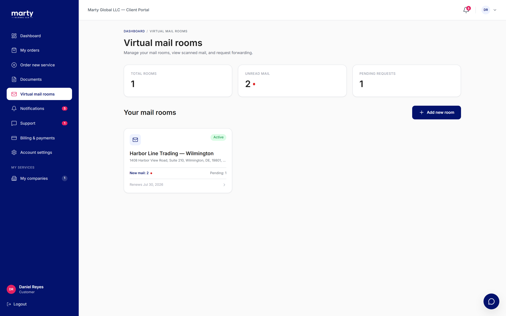

> Desktop: `Documentation/screenshots/07-01-mailroom-overview-desktop.png`
> Mobile: `Documentation/screenshots/07-01-mailroom-overview-mobile.png`

**Add new room** starts an ordinary order for the Virtual Mail Room service —
same three steps as [Part 4](#part-4--ordering-a-service).

## 7.2 A room's inbox

Opening a room shows its address and its post.

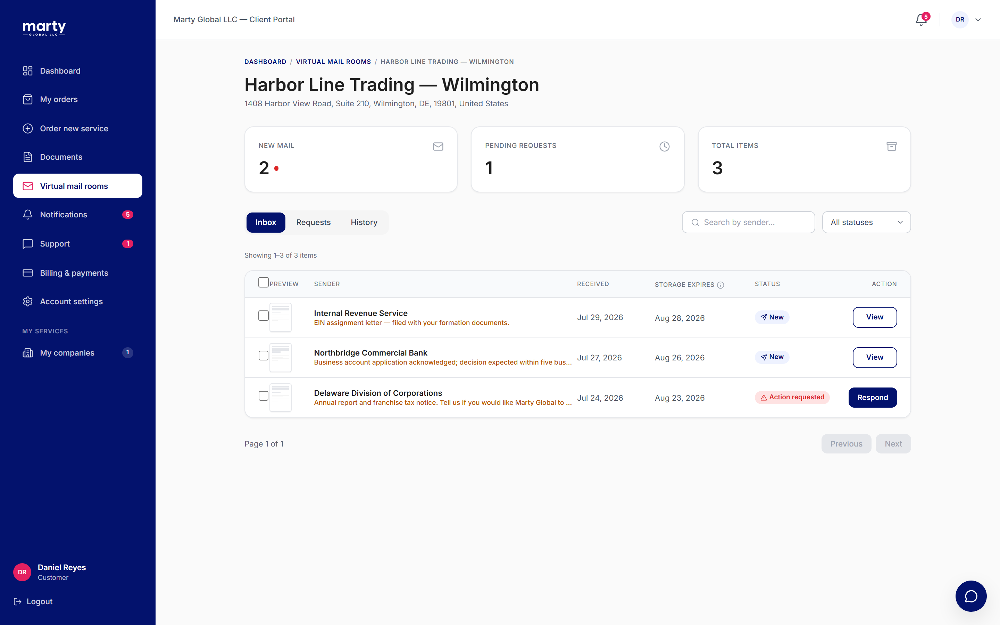

> Desktop: `Documentation/screenshots/07-02-mailroom-inbox-desktop.png`
> Mobile: `Documentation/screenshots/07-02-mailroom-inbox-mobile.png`

**The three figures** are **New mail**, **Pending requests** (forwarding or
shredding we are working on), and **Total items**.

**Three tabs** split the room: **Inbox** (current post), **Requests** (your
forwarding and shredding requests and where they have got to), and **History**
(everything handled). **Search by sender…** and the **All statuses** filter
narrow the list.

Each item shows a thumbnail of the scan, the **sender**, the note our mail team
added, when it was **received**, when its **storage expires**, and its status:

| Status | Meaning |
| --- | --- |
| **New** | Scanned, not opened yet. |
| **Action requested** | We think this one needs a decision from you — its button reads **Respond** rather than **View**. |

> **Storage expires** is a real date. We hold the physical item until then; after
> that it is disposed of securely. The scan stays in your account. If you want
> the original, request forwarding before that date.

## 7.3 Reading an item

**View** (or **Respond**) opens the item in a panel over the list — a side panel
on desktop, a full screen on a phone.

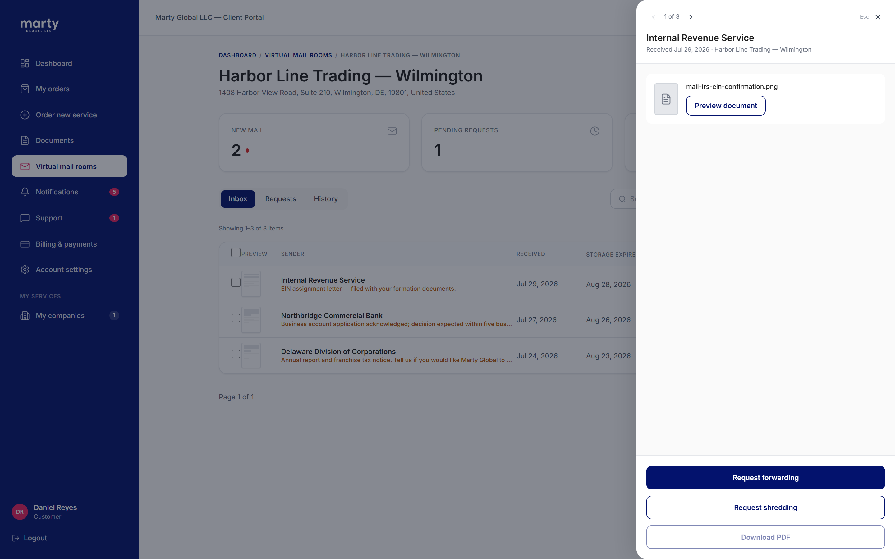

> Desktop: `Documentation/screenshots/07-03-mail-item-viewer-desktop.png`
> Mobile: `Documentation/screenshots/07-03-mail-item-viewer-mobile.png`

The header shows the sender, the date received, and which room it came to. **‹ 1
of 3 ›** steps through the room without going back to the list. **Esc** or **✕**
closes the panel.

- **Preview document** opens the scan in a new browser tab, through a
  short-lived secure link. If the tab does not appear, allow pop-ups for the
  site.
- **Download PDF** saves the scan.
- **Request forwarding** — we post the physical item to your company address.
- **Request shredding** — we destroy the physical item securely. The scan stays
  in your account.

## 7.4 Requesting forwarding or shredding

Choose either action and the panel confirms with **We're working on your request
for this item**. It also appears under the **Requests** tab and in **Pending
requests**, and you are notified when it is done.

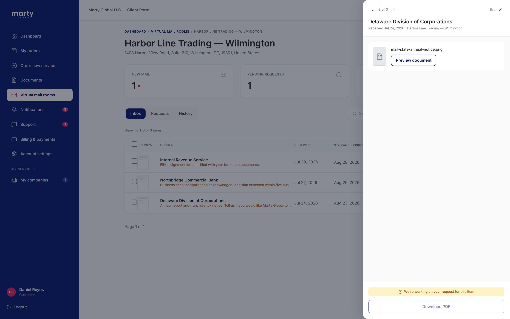

> Desktop: `Documentation/screenshots/07-04-mail-forwarding-request-desktop.png`
> Mobile: `Documentation/screenshots/07-04-mail-forwarding-request-mobile.png`

> **Forwarding needs a destination.** If you have not filled in your company
> address, the panel says *Add a company address in your account settings before
> requesting forwarding*. Fill it in under **Account settings → Company
> details** ([Part 12.2](#122-company-details)) and try again.

---

# Part 8 · Your document library

**Documents** is every file connected to your account in one place: what we
filed for you, what you sent us, and your scanned mail.

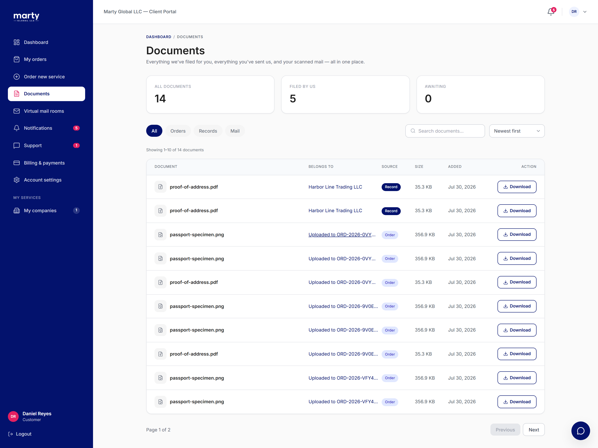

> Desktop: `Documentation/screenshots/08-01-documents-library-desktop.png`
> Mobile: `Documentation/screenshots/08-01-documents-library-mobile.png`

**The three figures** are **All documents**, **Filed by us** (documents we
produced — certificates, agreements, registry filings), and **Awaiting**
(documents we have asked you for and not received).

> If **Awaiting** is not zero, something is holding an order up. The tab tells
> you which document, and you upload it from that order's **Documents** panel.

**Four tabs** filter by where a file came from — **All · Orders · Records ·
Mail** — alongside **Search documents…** and a sort (default **Newest first**).

Each row gives the file name, what it **belongs to** (a linked company, order, or
mail item), its **source** tag, size, the date added, and **Download**.

The **source** tag tells you the file's origin at a glance:

| Tag | Meaning |
| --- | --- |
| **Record** | Produced by us and attached to a delivered record. |
| **Order** | Uploaded by you with an application. |
| **Mail** | A scan from one of your mail rooms. |

Long libraries page at the bottom with **Previous** and **Next**.

---

# Part 9 · Your companies and records

When we finish a service, the result becomes a permanent **record** in your
portal — not just a completed order. Records get their own section in the
sidebar under **MY SERVICES**, named for what they are: **My companies** for
formations, and similar entries for other services as they are delivered.

## 9.1 My companies

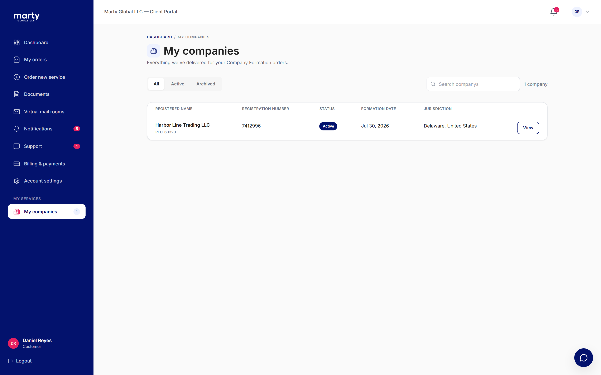

> Desktop: `Documentation/screenshots/09-01-my-companies-desktop.png`
> Mobile: `Documentation/screenshots/09-01-my-companies-mobile.png`

Every company we have formed for you, with its key details and status. Open one
for the full record.

## 9.2 A company record

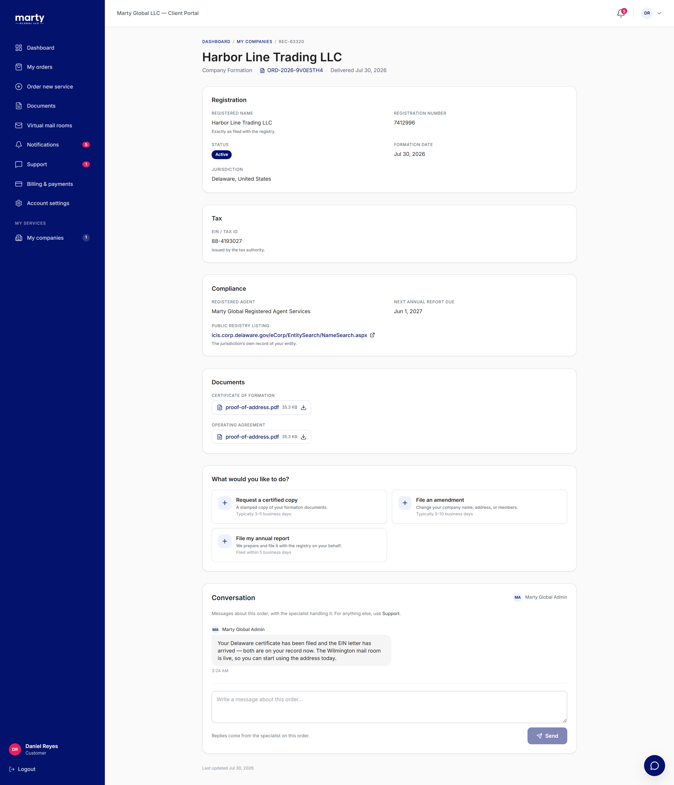

> Desktop: `Documentation/screenshots/09-02-company-record-desktop.png`
> Mobile: `Documentation/screenshots/09-02-company-record-mobile.png`

The heading is the registered name, with its record number, the service that
produced it, a link back to the **order**, and the delivery date. Below that:

- **Registration** — registered name (exactly as filed), registration number,
  status (**Active**, pending, dissolved), formation date, and jurisdiction.
- **Tax** — your **EIN / Tax ID** as issued by the tax authority.
- **Compliance** — your **registered agent**, the **next annual report due**
  date, and a link to the jurisdiction's own **public registry listing** so you
  can verify the entity independently.
- **Documents** — the papers we filed, each labelled by kind (*Certificate of
  formation*, *Operating agreement*) with a download button.
- **What would you like to do?** — the follow-up services available on this
  record (see below).
- **Conversation** — messages about this record with the specialist who handled
  it.

> **Next annual report due** is the date to diary. We hold the registered agent
> appointment, so the state's notice comes to your mail room and we remind you —
> but the obligation is the company's.

## 9.3 Asking for follow-up work

**What would you like to do?** offers the after-sales work available on this
record, each with its usual turnaround:

| Request | What it does | Typical time |
| --- | --- | --- |
| **Request a certified copy** | A stamped copy of your formation documents. | 3–5 business days |
| **File an amendment** | Change the company name, address, or members. | 5–10 business days |
| **File my annual report** | We prepare and file it with the registry for you. | Within 5 business days |

Choosing one opens a short dialog: it repeats what the request is and how long it
takes, and gives you an optional box — *Anything else we should know?* — for
details such as how many copies you need or exactly what is changing.

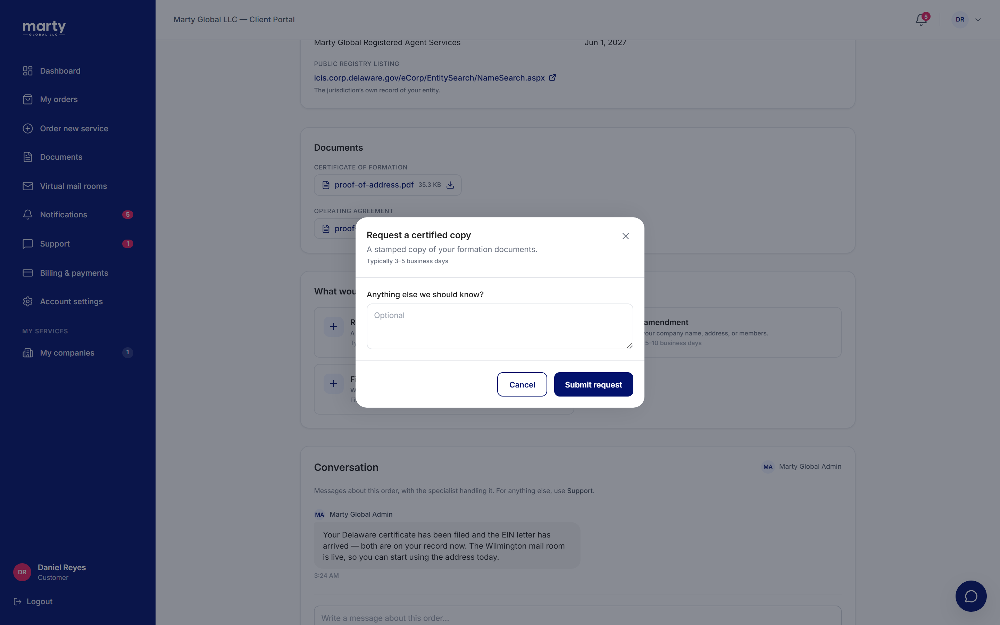

> Desktop: `Documentation/screenshots/09-03-record-followup-request-desktop.png`
> Mobile: `Documentation/screenshots/09-03-record-followup-request-mobile.png`

**Submit request** sends it to our team; **Cancel** closes without sending. If
the work carries a fee, you get a quote for it the same way as any other order —
review it and pay from **Billing & payments**.

---

# Part 10 · Talking to us

There are three ways to reach us, and they are for different things.

| Route | Use it for |
| --- | --- |
| **Support** | Anything general — questions, problems, account matters. |
| **An order's Conversation** | Anything about that specific application. |
| **The chat bubble** | A quick question from any screen. |

## 10.1 Your conversations

**Support** lists your conversations with the team, most recent first, with a
search box.

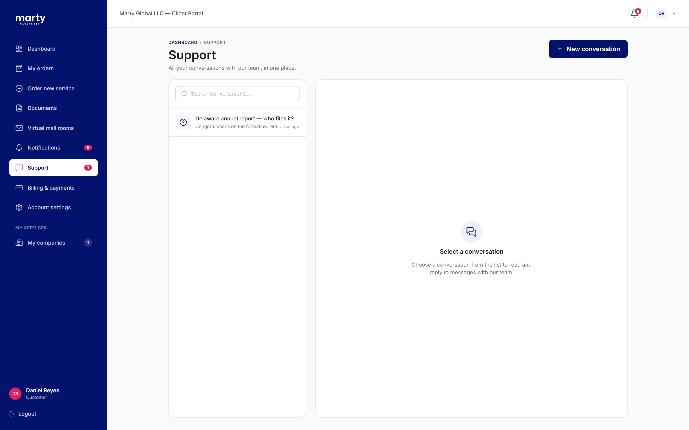

> Desktop: `Documentation/screenshots/10-01-support-list-desktop.png`
> Mobile: `Documentation/screenshots/10-01-support-list-mobile.png`

## 10.2 A conversation

Opening one shows the whole thread with a box to reply at the bottom. Messages
arrive live — no refreshing.

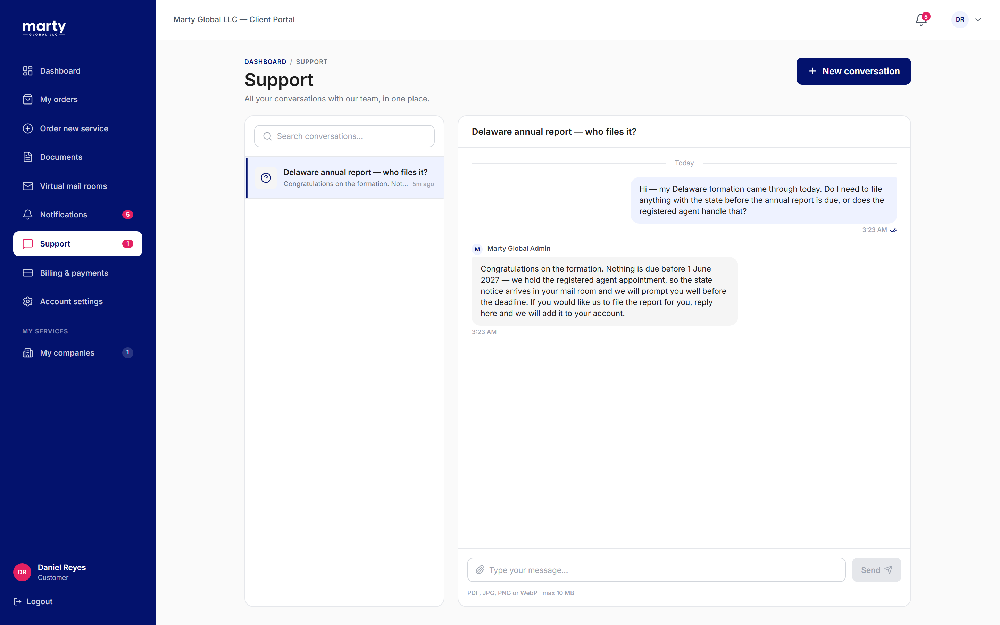

> Desktop: `Documentation/screenshots/10-02-support-thread-desktop.png`
> Mobile: `Documentation/screenshots/10-02-support-thread-mobile.png`

On a phone the list and the thread are separate screens; the back arrow in the
thread header returns you to the list.

## 10.3 Starting a conversation

**New conversation** opens a short form:

- **What is this about?** — a subject line. A specific one gets to the right
  person faster.
- **Give us as much detail as you can…** — the message itself. Include order
  references where they are relevant.

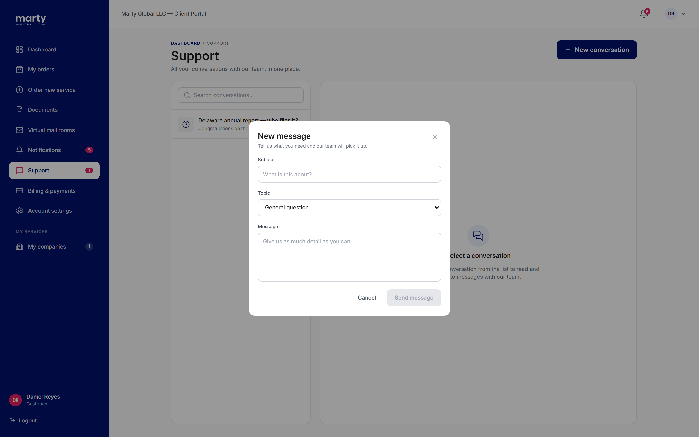

> Desktop: `Documentation/screenshots/10-03-support-new-conversation-desktop.png`
> Mobile: `Documentation/screenshots/10-03-support-new-conversation-mobile.png`

**Send message** opens the thread. **Cancel** discards it.

## 10.4 The chat bubble

The bubble in the bottom-right corner follows you around the portal, so you can
ask something without leaving what you are doing. It shows your current
conversation, with a box to type and an attachment button (PDF, JPG, PNG, up to
10 MB).

If no one is available the header says so — *We're away — we'll email you a
reply* — and your message is queued rather than lost.

**View all conversations ↗** opens the full **Support** screen.

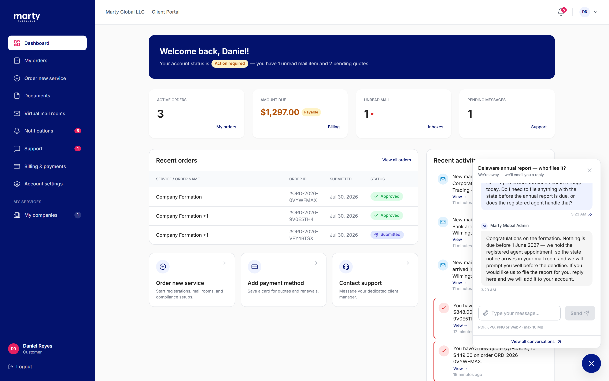

> Desktop: `Documentation/screenshots/10-04-live-chat-widget-desktop.png`
> Mobile: `Documentation/screenshots/10-04-live-chat-widget-mobile.png`

---

# Part 11 · Notifications

**Notifications** is the full history of everything we have told you — the bell
panel only shows the latest few.

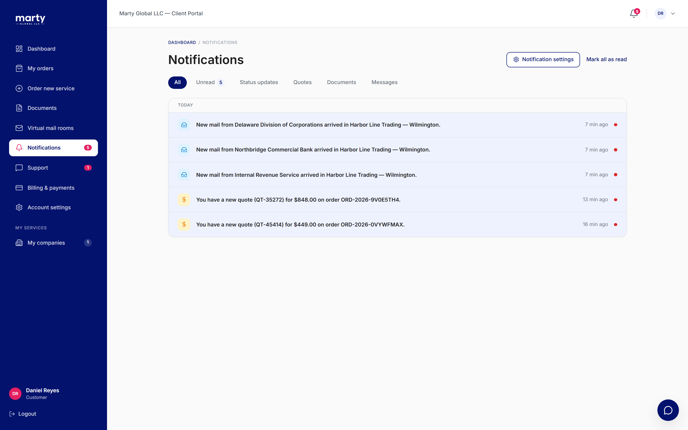

> Desktop: `Documentation/screenshots/11-01-notifications-feed-desktop.png`
> Mobile: `Documentation/screenshots/11-01-notifications-feed-mobile.png`

**Tabs** filter the feed: **All · Unread · Status updates · Quotes · Documents ·
Messages**, with a count on *Unread*.

Notifications are grouped by age — **Today**, **This week**, **Earlier** — newest
first. Unread ones are tinted with a red dot on the right. Each is a link:
clicking a mail notification opens that item, clicking a quote notification opens
that quote. Scroll to the bottom to load older entries.

Two controls sit at the top right: **Mark all as read** clears everything, and
**Notification settings** jumps to the preferences described in
[Part 12.4](#124-notification-preferences).

---

# Part 12 · Account settings

**Account settings** holds four sections. On desktop they are a list on the left
with the chosen one open beside it. On a phone you get the list first and tap
through to a section, then use back to return.

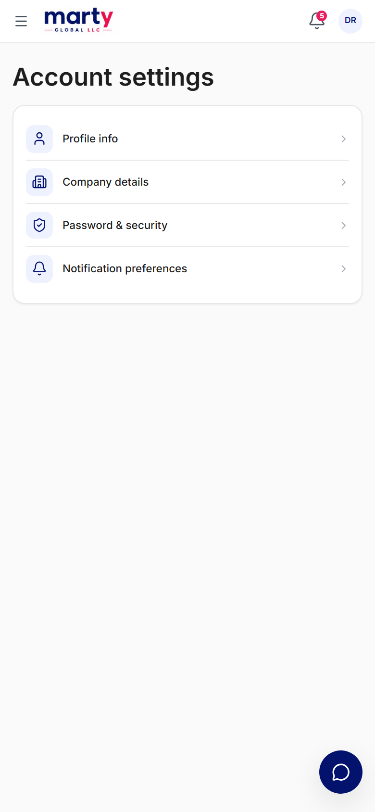

> Mobile only: `Documentation/screenshots/12-05-settings-sections-mobile.png`

## 12.1 Profile info

Who you are on the account.

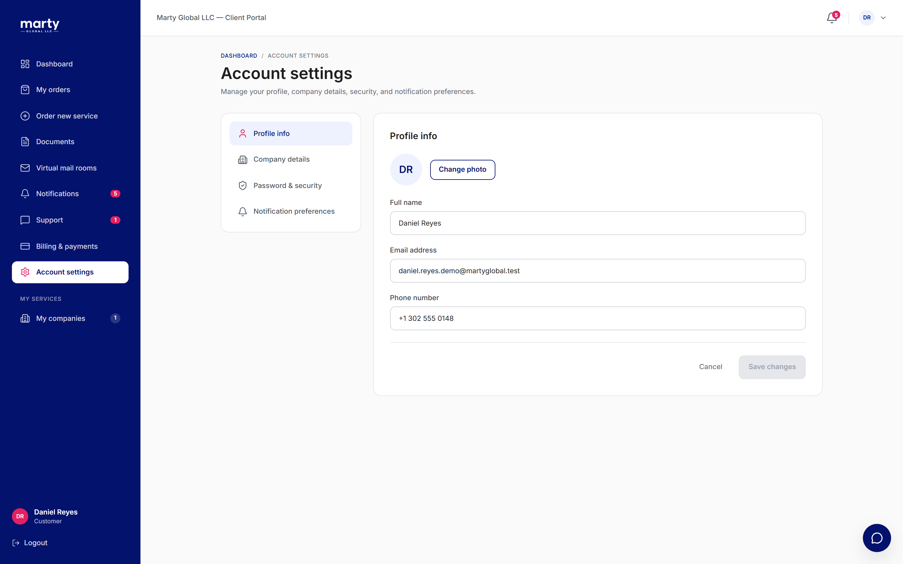

> Desktop: `Documentation/screenshots/12-01-settings-profile-desktop.png`
> Mobile: `Documentation/screenshots/12-01-settings-profile-mobile.png`

**Change photo** replaces the initials shown around the portal. **Full name**,
**Email address**, and **Phone number** are all editable.

**Save changes** stays greyed out until you actually change something, so you
can never save a no-op. **Cancel** discards your edits.

> Your email address is where quotes, confirmations, and password resets go.
> Change it only to an address you can read, and check the new one works.

## 12.2 Company details

Your business's own details, used on filings and as your **forwarding
destination** for mail.

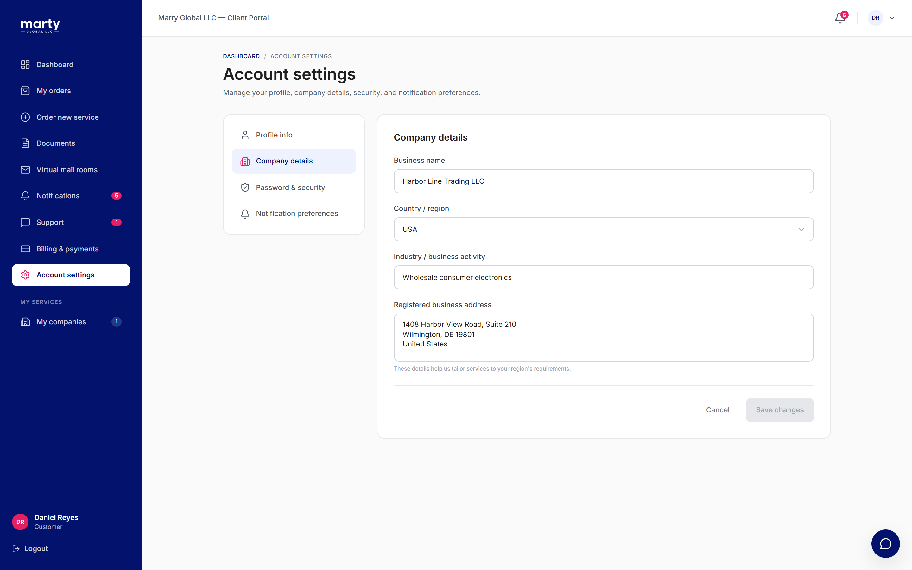

> Desktop: `Documentation/screenshots/12-02-settings-company-details-desktop.png`
> Mobile: `Documentation/screenshots/12-02-settings-company-details-mobile.png`

Business name, country, industry, and full postal address.

> Fill this in before you request mail forwarding — it is the address we post to,
> and [Part 7.4](#74-requesting-forwarding-or-shredding) will block the request
> until it exists.

## 12.3 Password & security

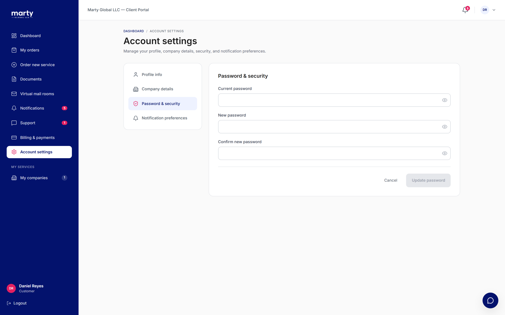

> Desktop: `Documentation/screenshots/12-03-settings-password-security-desktop.png`
> Mobile: `Documentation/screenshots/12-03-settings-password-security-mobile.png`

Enter your **current password**, then the **new password** twice. The eye icon on
each field reveals what you typed. **Update password** applies the change.

If you cannot remember your current password, log out and use **Forgot
password?** instead ([Part 2.3](#23-forgotten-password)).

## 12.4 Notification preferences

Control exactly what we contact you about, and how.

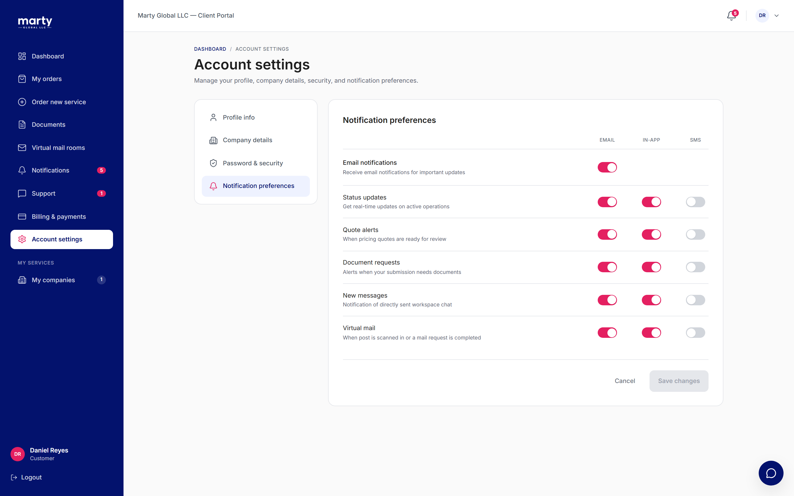

> Desktop: `Documentation/screenshots/12-04-settings-notification-preferences-desktop.png`
> Mobile: `Documentation/screenshots/12-04-settings-notification-preferences-mobile.png`

It is a grid: each kind of notification is a row, and the three ways we can reach
you — **EMAIL**, **IN-APP**, **SMS** — are the columns. Toggle any cell.

| Notification | Sent when |
| --- | --- |
| **Status updates** | An order changes state. |
| **Quote alerts** | A quote is ready for review. |
| **Document requests** | We need a document from you. |
| **New messages** | Someone replies to you. |
| **Virtual mail** | Post is scanned in, or a mail request completes. |

The top row, **Email notifications**, is the master switch for email: turn it off
and every email column goes with it, whatever the individual rows say.

**Save changes** applies your choices.

> **In-app** notifications are the bell and the *Notifications* screen. Leaving
> those on for quotes and document requests is wise — they are the ones that
> hold your filings up.

---

## Logging out

**Logout** at the bottom of the sidebar ends your session. If you ticked
**Remember Me** when logging in, logging out clears that too, and you will be
asked for your password next time.

---

## Quick reference

| I want to… | Go to |
| --- | --- |
| Order a service | **Order new service** |
| See how an application is going | **My orders** |
| Pay a quote | **Billing & payments → Pay now** |
| Read my post | **Virtual mail rooms** → your room |
| Have post sent to me | Open the item → **Request forwarding** |
| Find a certificate or file | **Documents** |
| Check my company's details or EIN | **My companies** → the company |
| Ask for a certified copy or an amendment | **My companies** → the company → *What would you like to do?* |
| Ask a question | **Support**, or the chat bubble |
| Change my email or password | **Account settings** |
| Stop an email | **Account settings → Notification preferences** |

---

## Appendix · Notes for the documentation team

*Internal. Remove before publishing.*

**Environment.** Captured from the local development stack (frontend
`localhost:5173`, API `localhost:4000`) on 30 July 2026, against a demo customer
`daniel.reyes.demo@martyglobal.test`. Three orders exist: `ORD-2026-VFY4BTSX`
(Submitted), `ORD-2026-9V0E5TH4` (Approved, delivered — the Harbor Line company
and mail room), `ORD-2026-0VYWFMAX` (Approved, awaiting payment).

**Capture settings.** Desktop 1440 × 900, mobile 390 × 844, both at 2× pixel
density. The portal and admin shells are full-height with an inner scroll area,
so `fullPage` captures nothing beyond the viewport; long screens were captured by
growing the viewport to the measured content height instead. Product surfaces
render at 80% root font size (the compact-density scheme), which is why portal
text looks smaller relative to marketing pages.

**States not captured, and why.**

1. **A settled payment, payment history, and an invoice.** Crediting a quote
   requires a real USDT transfer on TRON, matched on-chain by the reconciliation
   job. No transfer was made, so *Payment history* is empty everywhere it
   appears and no invoice download exists. To complete these, send a Nile
   testnet USDT transfer of the exact quoted amount to the deposit address on
   the checkout screen, then recapture: `06-01`, plus new shots of a paid order
   and an invoice.
2. **Card payment.** Deferred by design; the option renders disabled with a
   **Soon** tag. No screenshot to add until it ships.
3. **An in-app scan viewer.** **Preview document** opens the scan in a new tab
   via a presigned R2 URL, so there is no in-app preview state to photograph.
   The guide describes the new-tab behaviour instead.
4. **Empty states.** Every screen was captured populated. The empty variants
   (*No orders yet*, *You're all caught up*, *No payments yet*) exist and read
   well — worth a short "your first week" section if you want them.

**Demo-specific text to watch in the screenshots.**

- `06-03-checkout-awaiting-*` reads **TRON (TRC-20) Nile Testnet only** because
  `TRON_NETWORK=nile`. Flagged in Part 6.3, but retake against mainnet config
  before publishing externally.
- Uploaded specimen files are named `passport-specimen.png` and
  `proof-of-address.pdf`; they appear as document names in `05-02`, `08-01`, and
  `09-02`. Both are synthetic documents generated for these captures — clearly
  marked as specimens on their face — and contain no real personal data.
- The record's *Certificate of formation* and *Operating agreement* both show
  `proof-of-address.pdf`, since one placeholder file was attached to both slots.
  Replace with distinct realistic filenames if you retake `09-02`.

**Data changes made while capturing.** Two junk catalog rows (`gh`, `uyy`) were
deleted from `/admin/catalog` so the order wizard showed only real services. The
demo customer's profile phone and company details were filled in; a mail
forwarding request and a certified-copy request were submitted from the customer
side.

**Screenshot index.** 90 files in `Documentation/screenshots/`, named
`<part>-<step>-<slug>-<desktop|mobile>.png`. Sorting the directory by name gives
the reading order of this guide. Two files are mobile-only
(`03-04-mobile-navigation-mobile.png`, `12-05-settings-sections-mobile.png`)
because they document a phone-only pattern.
